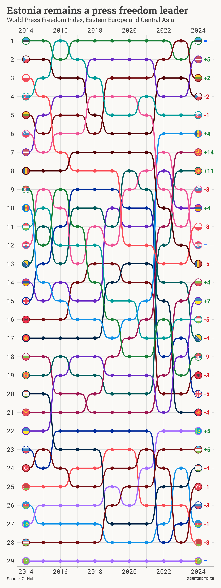

Reporters Without Borders (RSF) have published their annual [World Press Freedom Index](https://rsf.org/en/map-2024-world-press-freedom-index) a couple of months ago.

Overall, it shows what you’d expect: Nordic countries are at the top, Western Europe is doing okay, the US is doing a little worse, and most of East Asia and large chunks of Africa have a poor performance.

But what about Eastern Europe and Central Asia? Here’s a paragraph from the RSF:

> In Eastern Europe and Central Asia, media censorship has intensified in a spectacular mimicry of Russian repressive methods, especially in Belarus, Georgia, Kyrgyzstan, and Azerbaijan. Kremlin influence has reached as far as Serbia, where pro-government media carry Russian propaganda and the authorities threaten exiled Russian journalists. Russia, where Vladimir Putin was unsurprisingly reelected in 2024, continues to wage a war in Ukraine that has had a big impact on the media ecosystem and journalists’ safety.

Here’s each country’s progress for the past 10 years.

What this spaghetti-looking chart shows us is that the Baltics have taken the top three spots as the countries with the most press freedom, followed by the Czech Republic and Slovakia.

Notably, Poland has gone from #3 in 2014 to #11 this year, the second-biggest drop after Serbia.

Meanwhile, Macedonia has jumped from #21 to a respectable #7, the biggest increases in the last 10 years.

Like most other statistics involving Central Asia, Turkmenistan is squarely at the bottom.