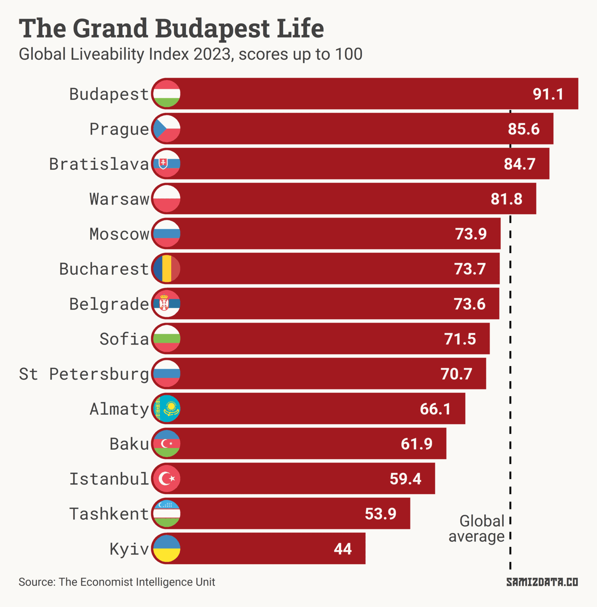
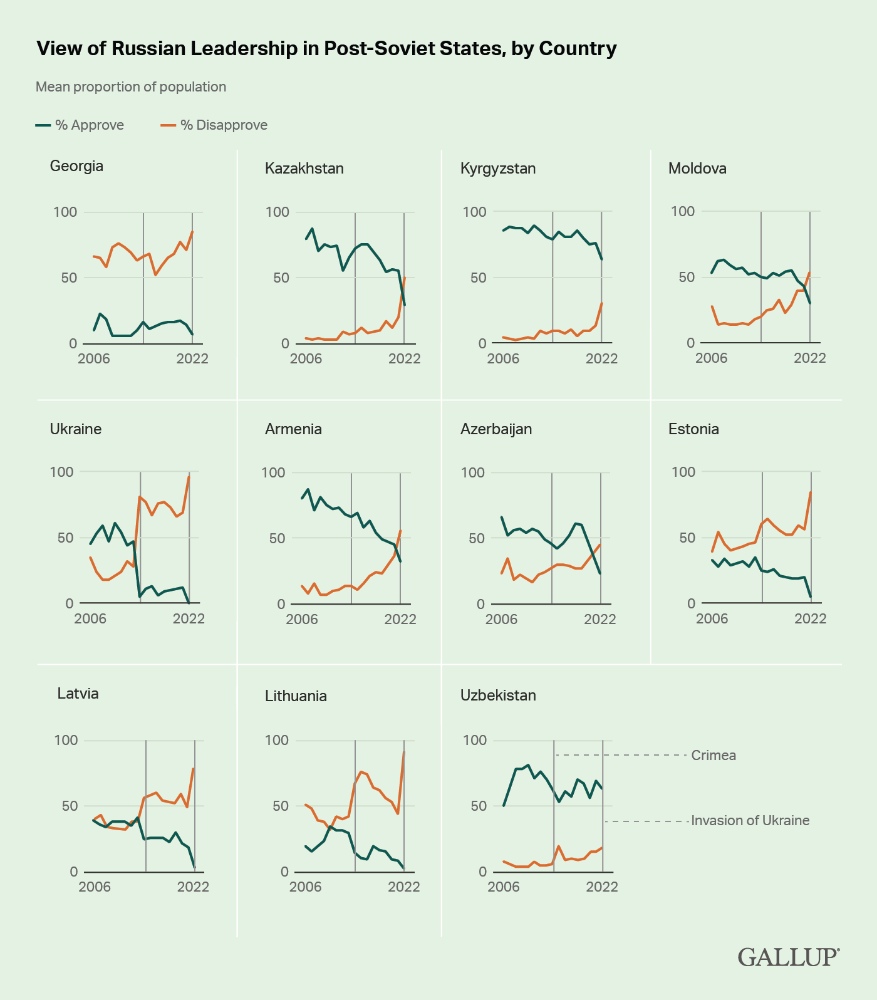

*The Economist*’s Intelligence Unit has recently published an update to its “Global Liveability Index”. You can read a [summary PDF here](https://pages.eiu.com/rs/753-RIQ-438/images/Jun-Global-Liveability-Index-2023.pdf) or, if you’ve got an extra **$10,995** stashed in your Swiss bank account, you can [buy a 12-month subscription to the data](https://store.eiu.com/product/global-liveability-matrix/).

For those of us who can’t afford to pay the equivalent of a [brand new Dacia Duster](https://www.topgear.com/car-reviews/dacia/duster) for a spreadsheet, what can we learn from the bits that are available to the public?

Let’s start with the good news. The world has, on average, better living conditions than at any point in the past 15 years. Some of it is down to a post-pandemic recovery, and some of it is down to improvements in healthcare and education.

How do Eastern Europe and Central Asia compare to other regions?

We’re not quite as good as the developed Western Europe, North America and Australasia regions, but not as bad as Latin America, the MENA region or Africa.

In the chart below, each dot is a city, and the further right they are, the better.

While most cities in Western Europe (save for Athens) and North America are crowded at the top of the rankings, there’s a fairly wide range in quality of life in Eastern Europe.

Budapest came out as the most “liveable” city in Eastern Europe, scoring a nice 91.1 out of 100. This puts it at 39th out of 173, with the same score as Chicago, Miami and Madrid. Prague, Bratislava and Warsaw also scored above average.

The further east you go, the worse it gets. Almaty, Baku and Tashkent are all in the bottom 30% of worst places to live, according to *the Economist*.

Kyiv has been on a downwards trajectory since Russia’s invasion of Crimea and Donbas in 2014. This year, Kyiv scored 44 out of 100, compared with 49.1 in 2021 and 67.9 in 2013. The Ukrainian capital was excluded from the ranking last year. It is now in the top 10 least liveable cities, with particularly bad scores for stability and infrastructure.

Moscow, meanwhile, has done little growth of its own since 2013, falling from 76.3 to 73.9. I suspect [being under threat of occupation from mercenary squads](https://www.bbc.co.uk/news/world-europe-66006880) might knock it down a few more notches next year. Russian cities score lower than before the war, largely due to Western sanctions as well as the actions of the Russian government itself.

Another city worth mentioning is Bucharest. While it was still quite low down the list at #99, it had the fourth-best growth compared to last year. This is most likely because of its post-pandemic recovery, rather than some radical improvement in liveability.

Overall, Eastern European and Central Asian cities have seen an improvement in their stability scores as the risk of Russia’s war of aggression in Ukraine spilling into other regions diminished because, as it turns out, the Russian army is incompetent.

Once Ukraine wins the war and rebuilds, stability and infrastructure should further improve in the region, pushing the overall score up. Until then, Budapest seems to be the place to live.

A few words on methodology: each city is given a score on 30 factors across five categories: stability, healthcare, culture and environment, education and infrastructure. These scores are then combined for an overall number from 1 to 100.

As to why this even exists, *the Economist* wants companies to use this as a guide to how much to pay employees to move to these cities. Moving to Kyiv should come with an extra 20% allowance, for example, while Istanbul and Tashkent should come with an extra 15%, etc.

---

## Postscriptum

Last month, I showed you that Russia’s claims of a “Russian World” outside its borders is often overstated, and that the number of people identifying as “Russian” is falling across Eastern Europe and Central Asia. Go read it if you haven’t: [The myth of the Russian World](/story/the-myth-of-the-russian-world/).

We have further confirmation of that from [some recent Gallup survey data](https://news.gallup.com/poll/505793/empire-twilight-russia-loses-support-own-backyard.aspx), which shows that increasingly fewer people in the countries with the largest Russian diasporas identify as Russian, with the trend accelerating in 2022.

The survey also shows that approval of Russia’s leadership has been declining in every single post-Soviet country, including among ethnic Russians. More than half of Kazakhstan, Moldova and Armenia now disapprove of Putin’s regime.

And speaking of post-Soviet countries, the *Associated Press* Stylebook, the go-to English style guide for journalism, [is now recommending](https://twitter.com/APStylebook/status/1676630291090112512) writers avoid the “former Soviet republic” cliché when introducing one of the 14 independent republics, unless it’s relevant to the story. Here’s to seeing less and less of that dreadful phrase in the future.

Another good piece of data journalism comes from *Mediazona* and *Meduza*, who used fancy machine learning to estimate that [at least 47,000 Russian soldiers died in Ukraine](https://en.zona.media/article/2023/07/10/stats) (here’s [the *Meduza* version](https://meduza.io/en/feature/2023/07/10/bring-out-your-dead)).