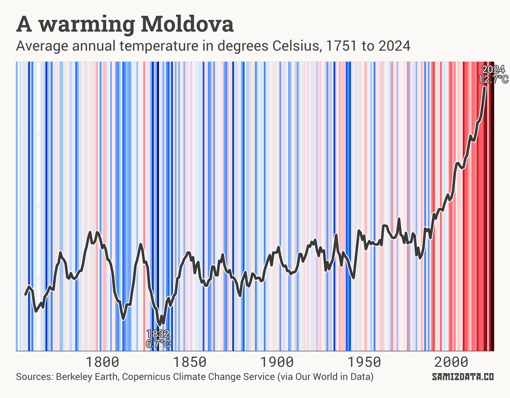
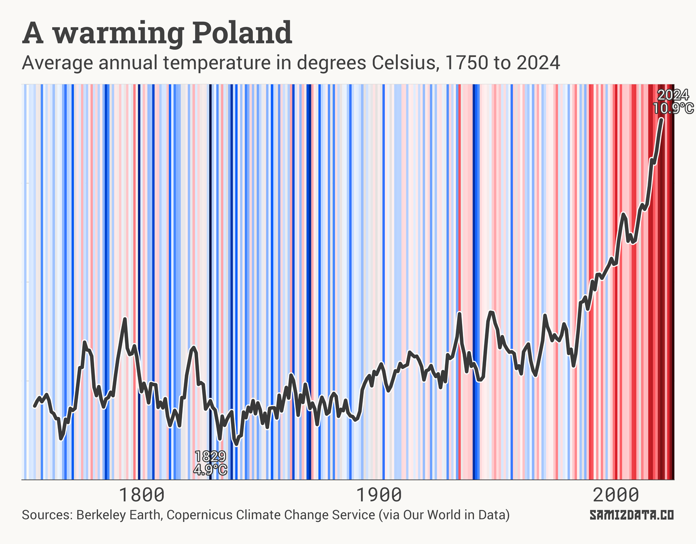
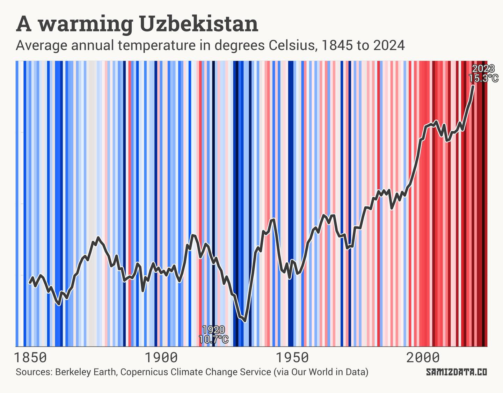
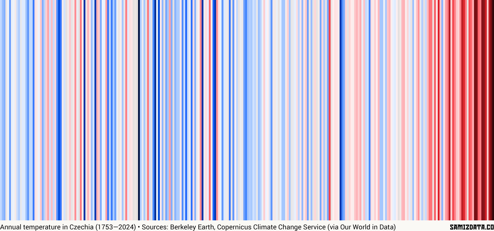

As this newsletter is going out, London is an unsufferable 33°C, [about 11°C degrees warmer than usual](https://istheukhotrightnow.com/).

In case you've been living under a cold rock, the world has been getting hotter, and Eastern Europe is no exception. Last year was the warmest year on record in Europe, with the central and eastern parts of the continent bearing the brunt of it.

According to the [Copernicus Climate Change Service](https://climate.copernicus.eu/european-state-climate-striking-east-west-contrast-and-widespread-flooding-europes-warmest-year), “southeastern Europe experienced its longest heatwave on record in July 2024”, exacerbated by “extreme events in central and eastern Europe associated with Storm Boris”. The future is looking grim as well. Central and eastern Europe are predicted to see an [increase in heavy rain and flash floods](https://discomap.eea.europa.eu/climate/) of up to 35% by 2100.

How hot has it really become?

---

In 2018, British scientist Ed Hawkins created the now famous “[climate stripes](https://www.reading.ac.uk/planet/climate-resources/climate-stripes)” charts. They were meant to be simple, straightforward ways to show the slow boil of our planet.

Today, for #[ShowYourStripes](https://bsky.app/search?q=%23ShowYourStripes) day, I made some climate stripes for Eastern European and Central Asian countries.

Let’s start with my own country, the Republic of Moldova. The average temperature throughout last year reached a record 12.7°C, some 3.4°C higher than the 1951-1980 average.

In the chart above, the line represents the 10-year average annual temperature for Moldova (to account for year-to-year spikes). The background stripes represent each individual year.

Here’s one for Poland, which shows a similar pattern of temperatures rising rapidly in the 1980s and reaching records in the last few years.

It’s a similar story in Central Asia. Uzbekistan has seen temperatures rise from an average of 12.6°C before 1980 to 15.3°C in 2023.

---

These charts are a deviation from the classic climate stripes, as they add the line and some additional labels.

But if you’re looking for the classic charts, I’ve got you covered. Here’s a climate stripes visualisation of temperature rise in Czechia.

If you want a chart for your own Eastern European or Central Asian country, I’ve made them [available for download](https://stripes.samizdata.co/). Feel free to share them

I’ve also made the code used to generate them [available here](https://github.com/nicucalcea/climate-stripes).

---

I’m in Poland for the next week or so. Let me know if you want to meet for a stout by replying to this email!