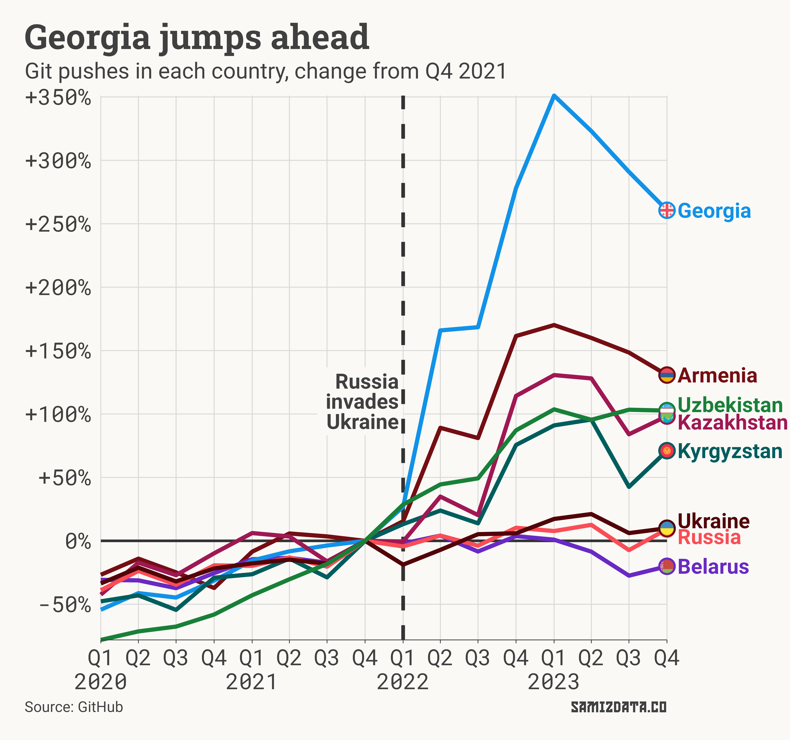
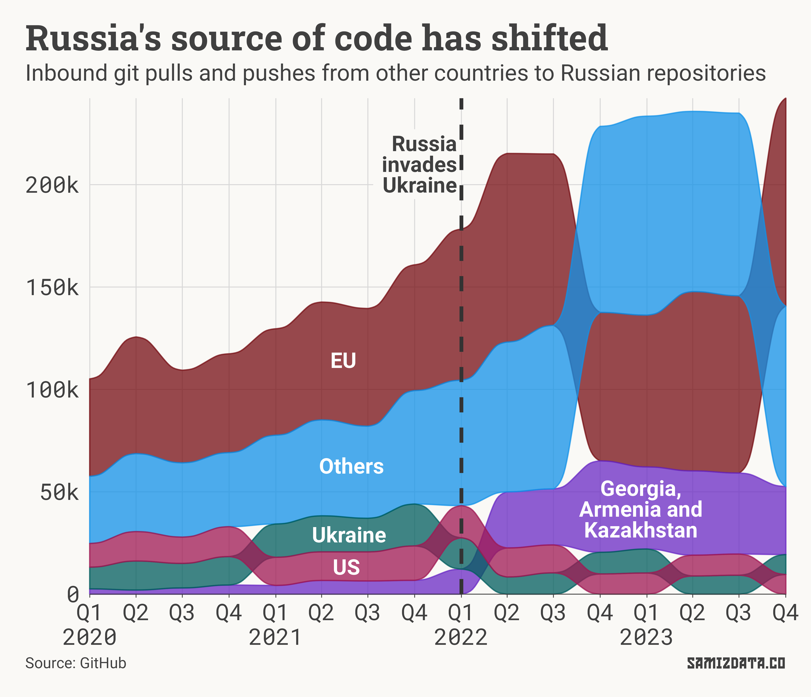
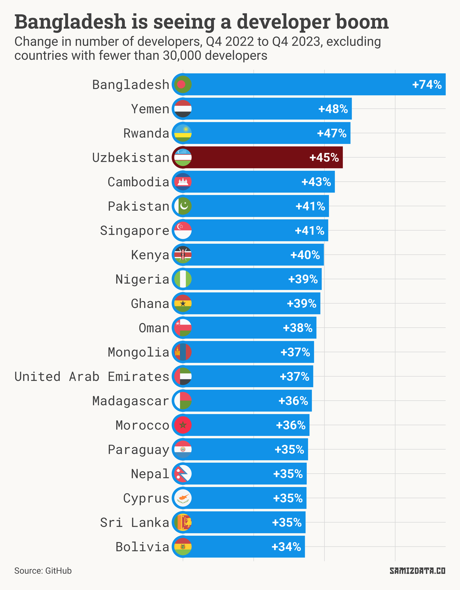
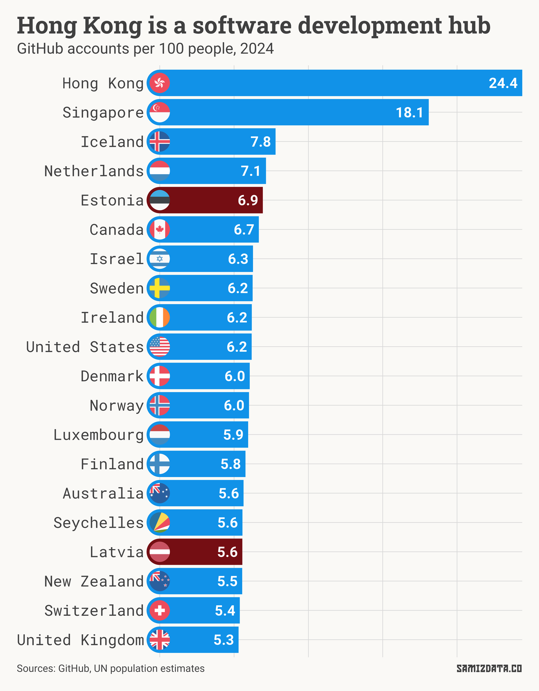
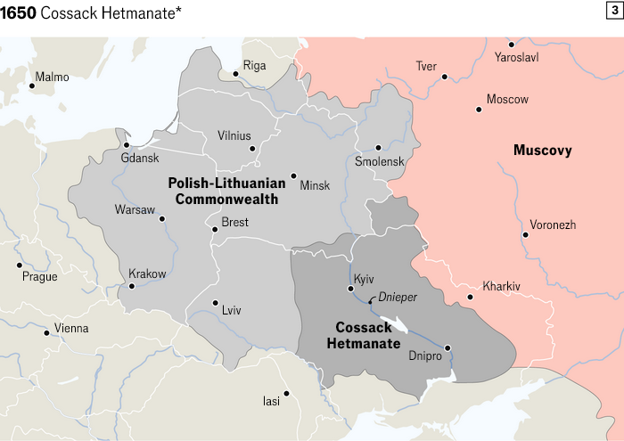

This February, Yandex, one of Russia’s best-known tech companies, [announced it would pull out of the country](https://www.bbc.co.uk/news/business-68213191).

Yandex co-founder Arkady Volozh pleaded with the EU to be removed from sanctions lists, saying he helped “thousands of engineers” leave the country, and that they would be “an asset wherever they land.”

Where exactly did these engineers land?

## Russia’s brain drain

By various estimates, Putin [has sent](https://en.wikipedia.org/wiki/Casualties_of_the_Russo-Ukrainian_War#Russian_invasion_of_Ukraine) 350,000 to 410,000 young men to die or become crippled in Ukraine. But Russian losses don’t stop there.

Many of those who dodged the draft chose to instead leave the country. Some young professionals — scientists, software engineers, project managers and the like — now fill up cafés in Yerevan and Tbilisi.

Official economic data from Russia is notoriously difficult to find, and even more difficult to believe. However, we can use alternative sources to get a picture of what’s happening.

Figures from [GitHub](https://github.com/github/innovationgraph), a popular platform for software developers to store and collaborate on code, reveal some interesting trends.

While the number of developers in all Eastern European and Central Asian countries has grown since the beginning of the war, it has done so at different rates.

Russia has seen a slowdown from the second quarter of 2022, while countries like Georgia and Armenia have experienced an unexpected surge.

Some of this may be natural evolution in developing countries such as Uzbekistan. Tools are becoming more accessible and AI makes coding easier.

But if we look at “git pushes” — a technical term that indicates how many times users upload code to GitHub — a wartime trend emerges.

The level of activity in Georgia quadrupled in just two years since the end of 2021, while Russian, Ukrainian and Belorussian activity remained relatively flat. In Armenia, the number of pushes more than doubled.

What does that tell us?

Perhaps the Caucasus is going through a technological revolution. But what’s more likely is that Russia’s brightest are now shining from neighbouring countries.

Georgia and Armenia are relatively small countries, with relatively low numbers of developers. But what about the big players?

## America is not playing any more

Since GitHub is a platform that enables collaboration between developers, let’s look at cross-border collaboration for some interesting trends.

The chart below shows the number of contributions (pushes and pulls) from developers outside Russia to Russian projects. For clarity and simplicity, I’ve combined some of the countries into bigger groups.

We can see that code contributions from Georgia, Armenia and Kazakhstan to Russian projects have increased significantly since the invasion.

The same is true for the collective “Others”, which includes every country not explicitly charted. Thailand, for example, saw a significant bump around when the war started.

This may indicate that many Russian developers have moved to these countries, but they continue to work for their Russian employers or collaborate with colleagues who have stayed behind.

Meanwhile, contributions from the EU to Russia have taken a hit, although they regained the top spot towards the end of 2023. Many Russians have relocated to Europe as well.

What about the other side of the coin? Who do the developers still in Russia work with?

Before the war, the US was typically the largest destination for Russian-written code, accounting for nearly half of all foreign pushes and pulls. Many American companies employed Russian coders for their expertise and low cost of labour.

Since the war, however, the number of Russian contributions to American projects has declined significantly, accounting for just a quarter by the end of 2023. Meanwhile, contributions to “other” markets have increased.

Perhaps the Russians who left the country were the ones most likely to work on US projects. Or perhaps Russians are now less likely to contribute to American projects, and Americans are less likely to welcome the contributions.

## The global picture

Let’s turn our attention away from Russia for a minute.

Bangladesh has seen a sustained growth in recent years. In the last year alone, the number of developers surged from 616,000 to almost 1.1 million. There were just 216,000 Bangladeshi developers on GitHub at the beginning of 2020.

While Bangladesh’s tech scene is booming, it’s important to note that those 1.1m developers are still just a small fraction of its population of about 174m.

On a GitHub accounts per capita basis, Hong Kong, Singapore and Iceland lead the chart.

Among Eastern European countries, Estonia, Latvia and Lithuania lead with around 5-7 GitHub accounts for every 100 people in the country.

They’re followed by Slovenia, Bulgaria, Czechia and, in large part due to the Russian exodus, Armenia.

At the other end, Central Asian countries such as Turkmenistan and Tajikistan only have one GitHub account for every 200 people.

It’s worth noting that one account doesn’t necessarily mean one software developer. GitHub is not the only platform to share code, and it’s more popular in some countries than in others.

Additionally, developers are free to register as many accounts as they want, while some accounts may be inactive.

However, the figures do seem to match my anecdotal sense, and they’re the best we have available.

---

I've been busy with [my new job](https://www.globalwitness.org/en/), so I’ve abandoned the newsletter for a bit. I’m hoping to start writing more often, perhaps combining shorter, one-chart stories with more in-depth analysis like this. Reply to this email if there’s anything that interests you.

In the meantime, check out this *Economist* story on the [ever-changing borders of Russia and Ukraine](https://www.economist.com/graphic-detail/2024/01/29/a-short-history-of-russia-and-ukraine).

And if you liked this article, you can always share it with someone else!