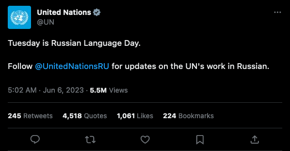
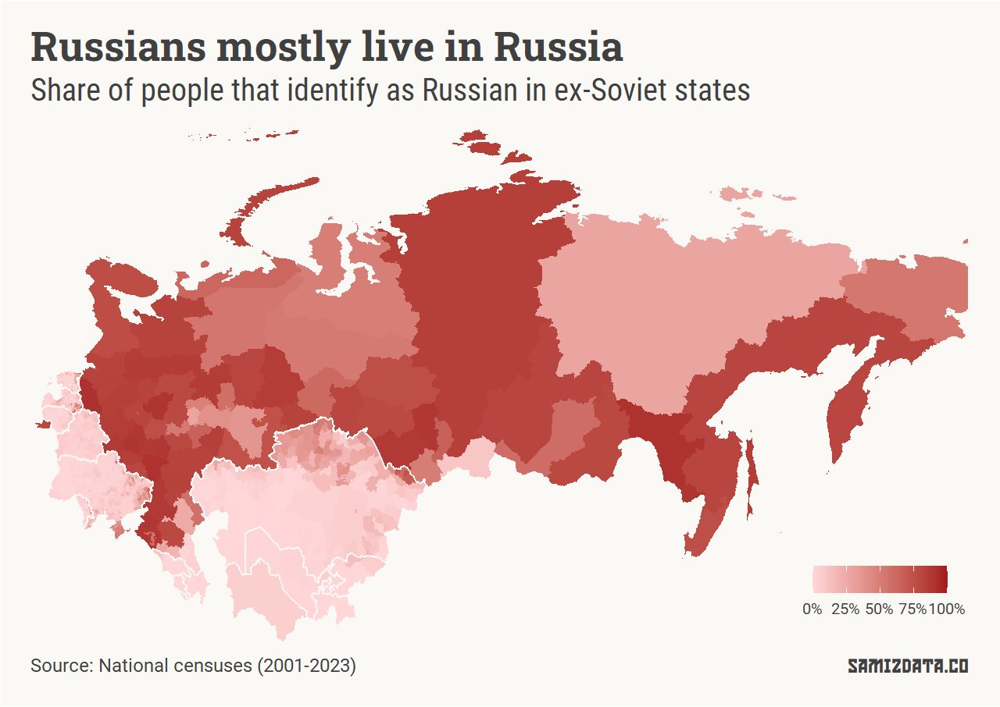
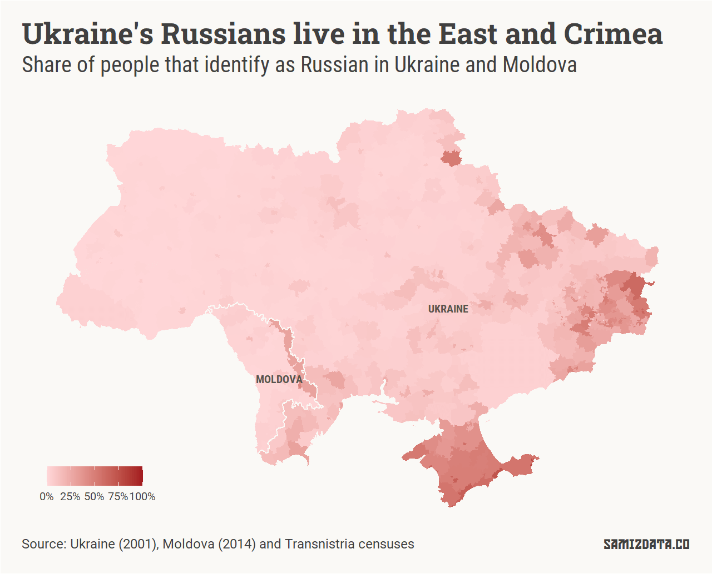
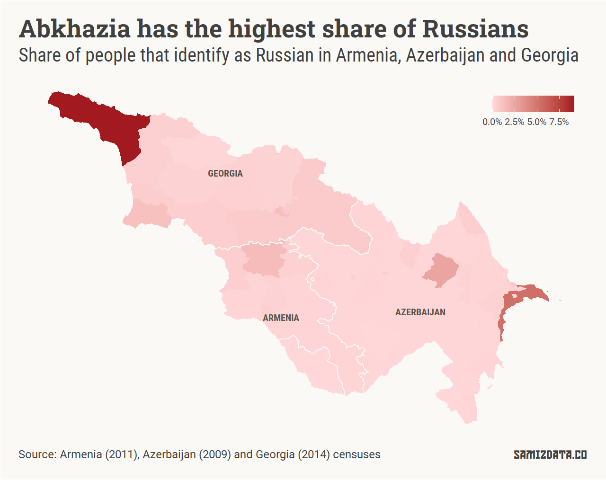
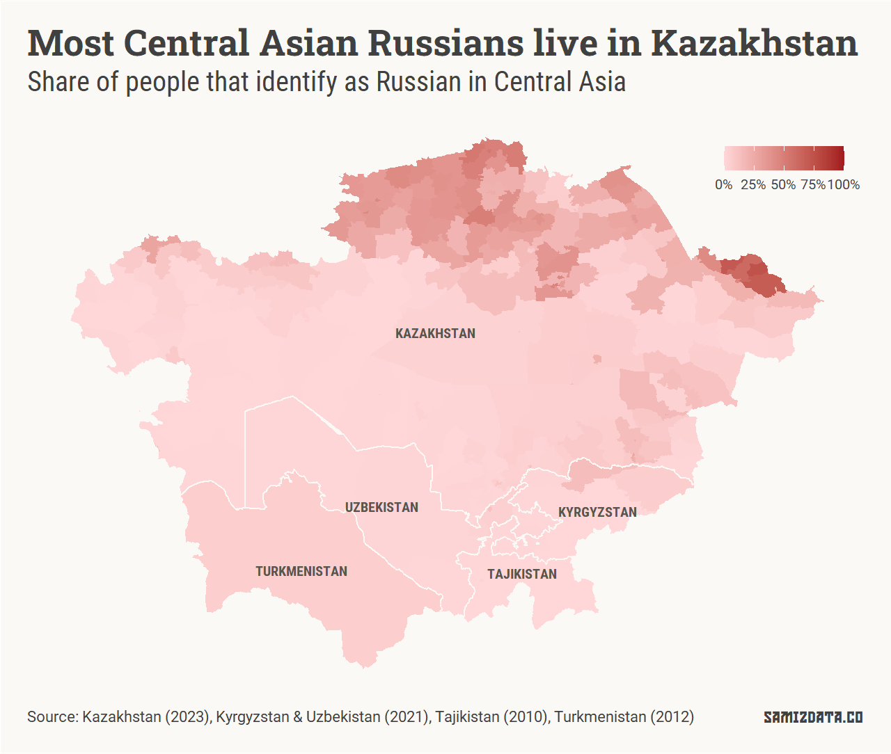
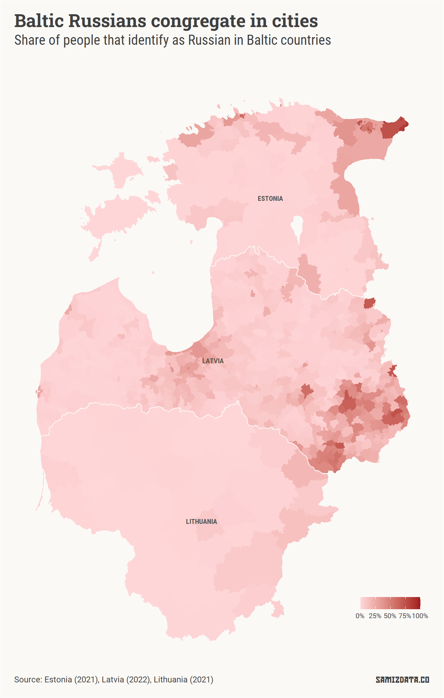
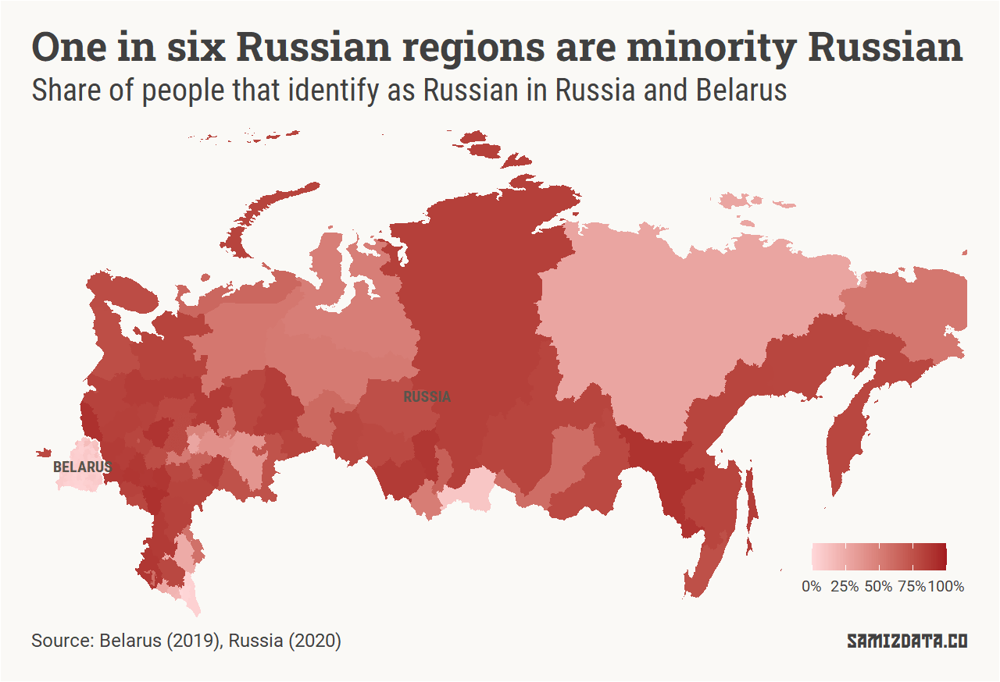

When Russia invaded Ukraine in February 2022, one of its excuses was that it wanted to [protect ethnic Russians](https://www.usip.org/publications/2022/04/how-kremlin-distorts-responsibility-protect-principle) living in the eastern part of the country.

To those of us living close to the biggest country on Earth, this sounded like a broken record. Russia has often used ethnic Russians abroad — their presence a result of Russia’s brand of colonial expansion — to harass and threaten its neighbours.

Last year, my colleague [Michael Goodier](https://twitter.com/michaelgoodier/) and I wrote an article for the *New Statesman* looking at [which countries could be next on Russia’s hit list](https://www.newstatesman.com/world/europe/ukraine/2022/07/which-countries-bordering-russia-invade-next-putin) based on the number of Russian speakers there.

Today, as Russia [destroys civilian infrastructure](https://www.bbc.co.uk/news/world-europe-65818705) and [floods Ukraine](https://www.bbc.co.uk/news/live/world-europe-65816109), the UN marks the Russian Language Day “in order to celebrate cultural diversity and multilingualism”.

So, who will be celebrating? For the most part, those who live in Russia.

While there are significant Russian populations across the ex-Soviet states, particularly in Crimea and North-Eastern Kazakhstan, the map below clearly shows that Russians are largely contained within the national borders of the Russian Federation.

Scroll on for close-ups of specific regions for more detail.

To my knowledge, this is the most complete map of Russians in Eastern Europe and Central Asia. It comes with some caveats, but more on those at the bottom of the page.

---

## Ukraine and Moldova

Let’s start with a big ol’ disclaimer. The data for Ukraine is old. Its most recent census was in 2001, far older than any other country in this article.

There’s some anecdotal evidence that things have shifted significantly since then, and the share of Ukrainian residents who think of themselves as Russians is much smaller, but we’ll only know when Ukraine [finally sets a date](https://en.wikipedia.org/wiki/Next_Ukrainian_Census) for the next census.

In Moldova, the census doesn’t cover the separatist region of Transnistria, so I used their own unofficial figures instead.

## The Caucasus

As is the case with Transnistria above, it’s a bit of a struggle to get reliable data from Russia-backed separatist regions.

That is the case in Georgia as well, where the latest figures for Abkhazia come from an unrecognised referendum in 2014, which puts Russians at 9.1% of the population.

Elsewhere in Azerbaijan, Baku’s population was 5.3% Russian, with every other region under 3%. Please note that the scale on this map is much smaller than the ones above or below.

## Central Asia

Kazakhstan’s border towns still have a significant Russian presence. The city of Ridder in East Kazakhstan is 73.8% Russian, while over 60% of the people of Shemonaikha, Altay and Glubokoe considered themselves Russian.

Outside Kazakhstan, Kyrgyzstan’s Bishkek has a significant Russian minority of 15.1%.

## The Baltics

Around 87% of the people living in Narva and in Sillamäe in the eastern tip of Estonia are Russians. More than a third are Russian citizens.

The invasion of Ukraine has prompted a reckoning in Narva, with Russians living there split on the issue. The number of those applying for Estonian citizenship has doubled since then.

In the rest of the region, Russians largely live in the big cities, particularly the capitals.

## The Union State

While Russia is launching invasion campaigns to protect Russians abroad, its own country is less Russian than you might think.

Of the 83 federal subjects of Russia — its Republics and oblasts — 14 have a share of Russians smaller than 50%.

In fact, the North Caucasus area is remarkably non-Russian. Ingushetia is less Russian than the US, for example, while Chechnya is less Russian than Germany.

While seven out of 10 Belorussians speak Russian at home, only 7.5% of the population consider themselves Russian.

---

## Notes

Finding and aggregating data from different statistics offices, with websites in different languages and with varying degrees of quality, was hard.

I wrote more than 1,000 lines of code and many, many hours of manual data cleaning in order to put this together.

There were some calls I had to make. While most of the maps have the most granular data I could find, there are some exceptions. In Russia, for example, the 2010 census had ethnicity data down to the village level, but I couldn’t find the same data from the 2021 census.

Even if the more granular data were available, I’d probably not have used it. Each village has to be matched to where it belongs on a map, and that would be much more work than I’m willing to put in.

It should also be made clear that the data covers a very wide timeframe, 2001 to 2023. Things can change drastically in 20 years, particularly in a region as volatile as this. I have some doubts about the reliability of some of these stats too, particularly in Russia-backed separatist regions.

While I was working on this, I found a lot of interesting quirks, like the existence of the sizable [Kazakhstan German](https://en.wikipedia.org/wiki/Kazakhstan_Germans) minority.

I’d be interested in developing an interactive tool to explore all this data. You could select an ethnicity and browse through Eastern Europe and Central Asia at your own pace, uncovering migration oddities. If that sounds good to you, let me know by replying to this email.

---

## Postscriptum

Why did the Russians turn out to be so cruel? *NV Magazine*’s Yaroslav Hrytsak [actually attempted to answer that rhetorical question](https://english.nv.ua/opinion/why-did-the-russians-turn-out-to-be-so-cruel-opinion-50322795.html), and I highly recommend reading his article.

If this newsletter hasn’t fully satiated your Eastern European data journalism hunger, have no fear. In his latest [DaNumbers](https://danumbers.substack.com/) newsletter, [Francesco Piccinelli](https://danumbers.substack.com/p/all-you-need-to-know-about-democracy) explains why some ex-Soviet countries have managed to become functioning democracies, and some have not.

Until next time!