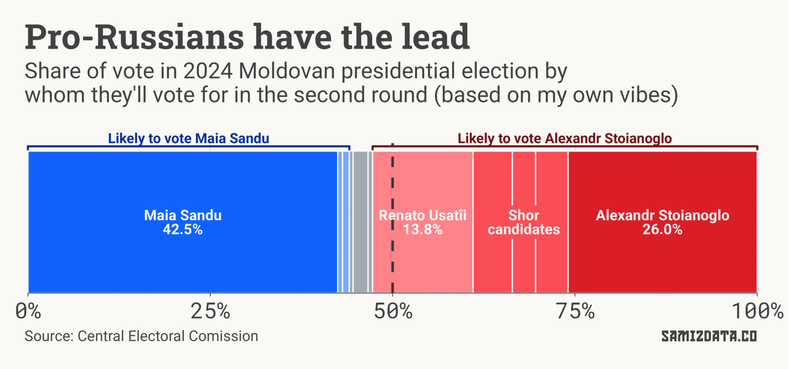
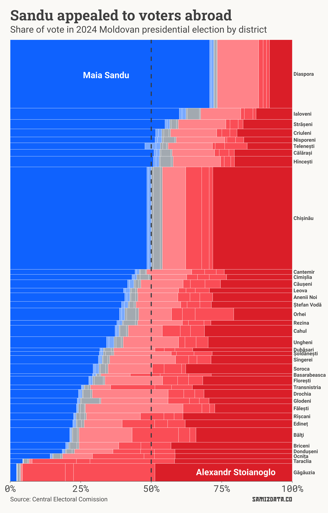
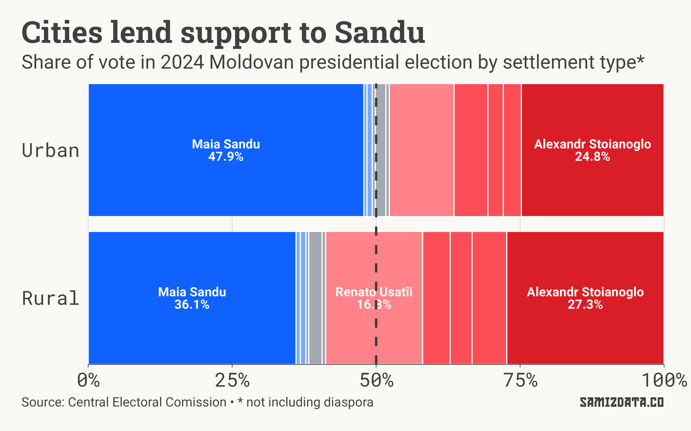
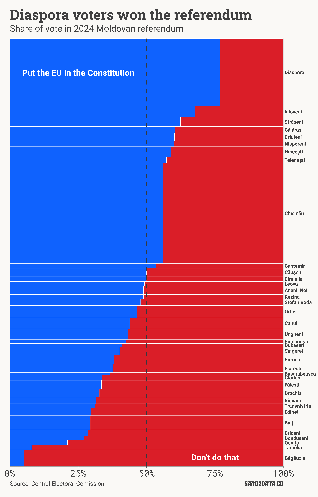

Hey there, it’s been a minute. Glad you’re still here 🥰.

---

Oligarch Bidzina Ivanishvili emerged as the winner in Georgia’s vote on Saturday, in what the [opposition called](https://www.bbc.co.uk/news/articles/c3wqq6l99w3o) a 'stolen' parliamentary election. There have been multiple documented instances of ballot stuffing and intimidation.

The presidential election in Moldova, just a week earlier, was thankfully a bit more peaceful.

Nevertheless, authorities in Moldova documented large-scale corruption ahead of the vote. Oligarch and notorious dipshit Ilan Shor [tried to bribe 130,000 voters](https://www.reuters.com/world/europe/moldova-police-say-businessman-shor-channelled-24-million-pay-off-voters-2024-10-24/) — nearly 10% of the final count — to cast their ballots for one of the pro-Russian candidates, and to vote against or abstain from voting in a referendum on the European Union. These are just documented cases, the police say the real number may be as high as 300,000.

Now that the Central Electoral Commission has published some data, let’s look at the results of the first round of the presidential election. Scroll further down for the referendum results.

## Presidential election

Incumbent president Maia Sandu came in first with **42.5%** of the vote, more than the 36.2% she got in the first round four years ago.

This may look like a good result for her, but it was lower than predicted by polls, and below the 50% threshold necessary to win, so we’re due a runoff next Sunday.

Sandu will face Alexandr Stoianoglo — a former prosecutor and relative newcomer to politics — who had the support of about **26%** of voters.

Nominally pro-European, he is backed by the pro-Russian Socialists Party, which he previously said was headed by a politician who received bags of cash from Moldova’s most infamous oligarch. This isn’t a metaphor, we’re talking about actual plastic bags full of cash, [caught on camera](https://www.ziarulnational.md/ultima-ora-noi-imagini-cu-punga-in-care-ar-fi-bani-pentru-dodon-despre-dodon-plahotniuc-si-alte-vietati-politice-de-la-noi-mi-am-asumat-o-misiune-complicata-de-a-prezenta-o-secventa-video-cu-trei-mari-corupti-si-penali/). But hey, that’s politics for you.

The outcome looks predictably boring, with Sandu some 16 points ahead of Stoianoglo. Surely that’s all sorted, then?

While the pro-European votes mostly fell in line behind Sandu this electoral season, the pro-Russian vote was more fragmented.

Aforementioned Ilan Shor, a guy who is [responsible for stealing about $1bn from the Moldovan people](https://en.wikipedia.org/wiki/2014_Moldovan_bank_fraud_scandal) and oxygen from the planet by continuing to exist, currently hiding in Moscow, has backed a handful of candidates.

Victoria Furtună (4.45%) and Vasile Tarlev (3.19%) are both understood to be Shor stand-ins, with Irina Vlah (5.38%) also [potentially serving as a backup choice](https://www.ipn.md/en/deschidemd-independent-irina-vlah-can-be-shors-reserve-7978_1105881.html).

Populist Renato Usatîi (13.8%) has lately positioned himself as an independent, but has historically sided heavily with Russian interests.

Together, all these candidates managed to win over half of the votes.

Does that mean we know the results of the second round? Not necessarily.

While Usatîi has long lauded Russia, he has refused to endorse either of the finalists. Nevertheless, his voter base is squarely pro-Russian, so I expect most of his votes to go to Stoianoglo.

Regardless, the results still paint a pretty grim picture. They are particularly shocking in some parts of the country.

The chart below shows the vote split by the different districts of Moldova, as well as the voters abroad. The height of each bar is proportional to the number of people who voted there.

What do the numbers tell us?

The Moldovan diaspora (👋) was Sandu’s most loyal base, with the sitting president receiving 70.7% of the vote from abroad.

In Chișinău, the capital, 48.5% voted for Sandu, though that goes up to about 50% if you add up the votes of the two other pro-Western candidates.

Sandu was chosen by the majority of voters in a few other central districts, such as Ialoveni and Strășeni.

At the other end, voters in the autonomous region of Găgăuzia — primarily inhabited by a Russian-speaking Turkic ethnic group — overwhelming rejected Sandu (just 2.4%). Tensions between Găgăuzia and Chișinău have always been high, but they have been rising in recent years after Evghenia Guțul, another Shor minion, became governor of the region.

Sandu had a poor performance in other districts in the south and north of the country. Surprisingly, she did better in Transnistria (25.2%), which is under Russian control and subjected to much higher levels of propaganda and censorship, than in other parts of Moldova.

As a general rule, Sandu was more popular in cities, while Usatîi’s campaign resonated more in the countryside.

#### What does this mean for next Sunday’s election?

The pro-Russian candidates seem to have the edge for now. The police have raided and arrested several of Shor’s lieutenants for voter corruption, somewhat disrupting his network.

As is often the case in Moldova, participation rates will determine the outcome. Pro-Russian voters skew older and tend to have a higher participation rate. If Sandu can activate her base in the next 6 days, and if the diaspora delivers again, there may still be a chance for her.

The real challenge for Moldova, however, is the parliamentary elections next year.

---

## EU referendum

In addition to the presidential election, Moldovans were also invited to vote on a constitutional amendment enshrining the country’s aspiration to join the EU.

Some pro-Russian presidential candidates, as well as some “neutral” ones, have called for a boycott of the referendum, hoping the participation rate would fall below the 33% threshold needed for it to be valid.

That plan backfired. If those who boycotted the referendum (some 57k people) voted against the constitutional amendment instead, it wouldn’t have passed. Instead, the “yes” campaign won on a razor-thin margin — 10.6k people or 50.35% of the votes.

Here, again, the diaspora (👋) was instrumental in making it happen.

The regional vote largely follows the same patter as the presidential election, except shifted slightly to the right (because of the boycott from the candidates on the left), so we won’t dwell on it too much.

Again, what’s surprising is that nearly a third (31%) of Transnistrian voters wanted to see Moldova in the EU, more than seven (!!!) other districts of the country. To note that participation rates in Transnistria are always pretty low.

Some districts like Ungheni and Cahul, both bordering Romania and the recipients of lots of EU funds, also voted against the constitutional amendment.

---

### What next?

Putin has poured an unprecedented amount of resources into this election. Is this a last ditch attempt to keep Moldova in his sphere of influence, or just an escalation in the hybrid war his country has been waging against my country since our independence?

It all depends on the result of the runoff election next Sunday.

If you’re a Moldovan citizen, please vote. If you’re someone who know a Moldovan, urge them to vote. If you’re neither… ugh… tell your friends to subscribe to my newsletter, I guess?