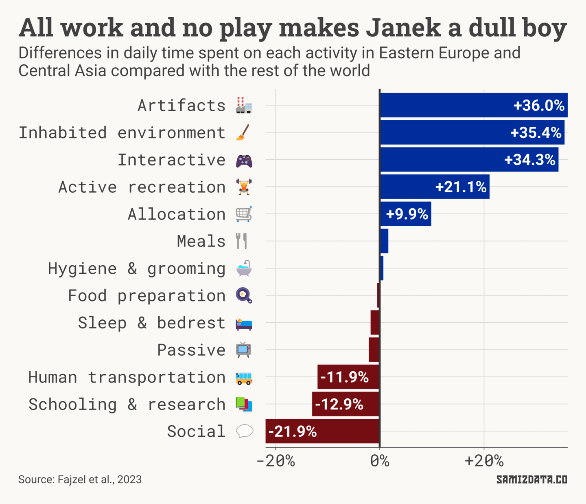
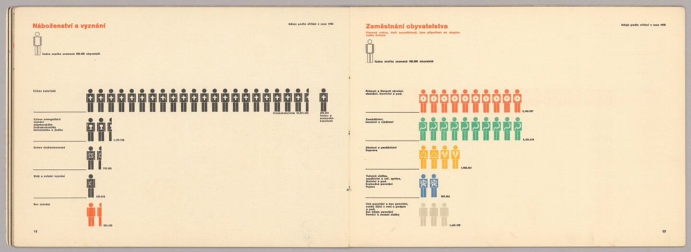

My goal to churn out a newsletter about once a month has fallen to the wayside. There are, after all, not enough hours in a day to sleep, work, eat, drink and also write a newsletter. Or are there?

The average human spends just over nine hours in bed, and another two and a half hours passively watching TV or listening to the radio.

Add work, cooking and the myriad of other things you’re expected to do to the mix, and that leaves you with only about an hour and four minutes for education and research, which is what I’m going to pretend I’m doing here.

But being Eastern European, I have even less time for luxuries such as research: just 48 minutes.

These figures come from a 2023 paper with the catchy title of *“[The global human day](https://www.pnas.org/doi/10.1073/pnas.2219564120)”*, which attempted to provide an overview of the average day of the eight billion people living on the planet.

The data is available on a country-by-country basis so, naturally, we can aggregate them to wider regions as well.

A few things are immediately obvious.

For one, it seems like Eastern Europeans spend about nine minutes more in bed than our neighbours in the west. If the figure seems high to you, it’s because it includes children.

We also spend an extra six minutes cooking, so we’re either less efficient, or our food is better. Living in the UK, I’ll let you guess which way I’m leaning.

But we also spend 28 fewer minutes on passive activities (meaning watching TV, listening to the radio, that sort of thing) and 10 fewer minutes driving or using public transportation.

## It’s us against the world

Let’s take this comparison up a notch.

The chart below shows the differences in time spent on different activities in Eastern Europe and Central Asia compared with the rest of the world, although I’ve removed activities that take less than half an hour for simplicity.

Eastern Europeans and Central Asians spend a third more time on “artifacts” which, in this study, means the manufacture of everything that’s not nailed down to the ground (textiles, medicine, cars, electronics, etc).

We also spend more time on “inhabited environment”, or cleaning, doing laundry, watering plants, and other household chores and on “interactive”, or having hobbies.

What we do less of is socialising with others — a fifth less than the rest of the world. We also spend less time on education or driving around.

### How does your country compare?

Interested in what the figures are for your country? Explore the data below.

<noscript></noscript>

---

### Postscriptum

Let’s start with some **personal news**. I have left my job at *BBC News* and am about to start a new one investigating the fossil fuels industry at *[Global Witness](https://www.globalwitness.org/en/campaigns/fossil-gas/)* (with data, of course).

If you’d like to get in touch about any tips, interesting data or anything else you’d like to talk about, reply to this email or find other ways to get in touch [on my website](https://nicu.md/).

---

#### Who is Estonia not letting in?

In a previous newsletter, I looked at where Russians live outside Russia. Narva in Estonia, on the border with Russia, stood out due to its high share of ethnic Russians.

Over the last year, Narva had to deal with an influx of border crossings and *ERR* [has published an analysis of who wasn’t allowed in](https://news.err.ee/1609207826/ppa-issuing-dozens-of-entry-bans-at-narva-border-crossing-every-day). Spoiler: Russians aren’t the biggest group.

#### Climate change and wine

Nevertheless, Estonians may have other reasons to celebrate. *The Economist* [has done a great interactive story](https://www.economist.com/interactive/christmas-specials/2023/12/20/global-warming-is-changing-wine) on how climate change is changing the wine landscape of Europe. If you don’t have a subscription ([ahem](https://archive.ph/Zxlnk)), the gist of it is this: start getting ready to drink a lovely Chardonnay from the Baltic coast.

#### Czechoslovak geography manuals

Finally, I stumbled upon [this lovely geography textbook from 1930s Czechoslovakia](https://www.davidrumsey.com/luna/servlet/s/781mzh) courtesy of [David Rumsey](https://twitter.com/DavidRumseyMaps/status/1737297332960690393). Some really good-looking charts in there!

