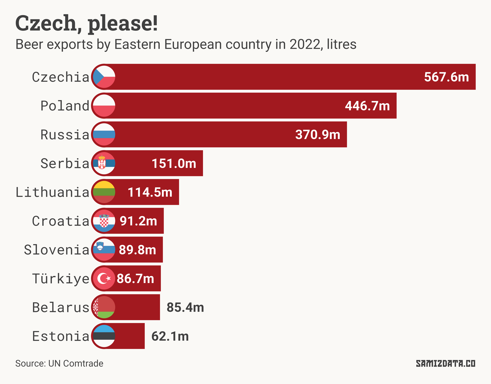
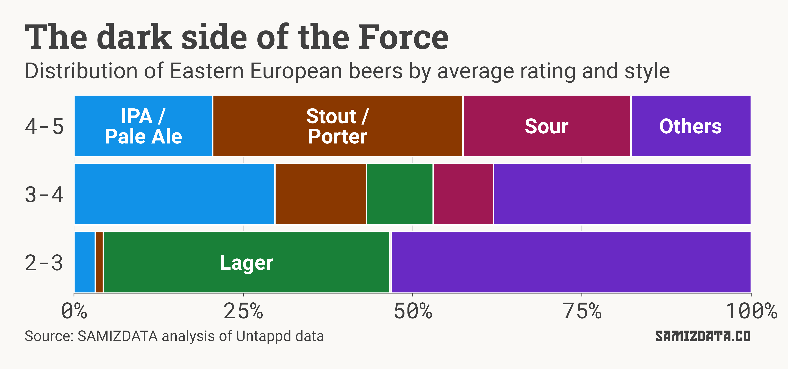
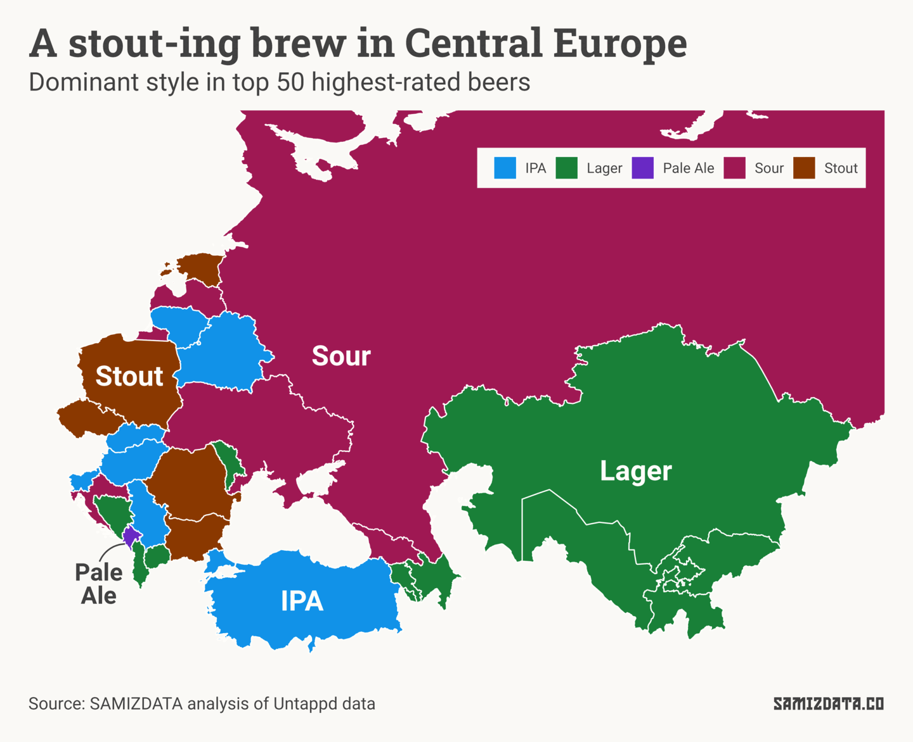

This newsletter comes to you a bit later than planned. That’s partially down to my laziness, and partially because I was on holiday.

While on this holiday, I discovered the excellent *Sofia Electric Brewing Co*, one of the best breweries I had the pleasure of giving my money to. I didn’t think of Bulgaria as the place I’ll discover good beer, which begs the question: is Eastern European beer any good?

Wikipedia [has a map](https://commons.wikimedia.org/wiki/File:Alcohol_belts_of_Europe.svg) that says the traditional drink of choice in Eastern Europe is wine in the south and vodka in the north. Only Czechia and, to some extent, Slovakia, are seen as traditional beer strongholds.

Considering that, it won’t surprise you to find that Czechia is Eastern Europe’s biggest beer exporter. According to the UN’s Comtrade database, the country exported 567.5 million litres of beer in 2022 alone.

But if my newsletter-writing habits are of any indication, it’s not about the quantity. While a cold *Staropramen* was [just what I needed on a morning pit stop in Bucharest](https://untappd.com/user/nicu/checkin/1302579518), it was not the best beer on my holiday.

For the past few months, I’ve been [tracking my beers](https://untappd.com/user/nicu) on Untappd, a social network for beer amateurs that allows you to rate beers on a scale from zero to five. The platform had nearly one million active users in 2020. Can we learn anything from them?

Only 10 of the 1,000 most popular beers on Untappd are from Eastern Europe. Half of those are Czech (*Pilsner Urquell*, *Budweiser Budvar*, *Staropramen Premium*, *Kozel Černý* and *Krušovice Imperial*), two are Polish (*Żywiec* and *Tyskie Gronie*), two are Croatian (*Karlovačko* and *Ožujsko*) and one is Turkish (*Efes Pilsen*).

We’ve re-established that Czech beers are popular among the masses. What about wannabe beer aficionados like myself?

I’ve scraped 23,517 of the best-rated beers on Untappd to see if there’s anything to learn. Note that these are only beers with 150 or more ratings, so this analysis might not include that craft microbrewery in your neighbourhood.

What’s the best beer in Eastern Europe, then? *[As Good As It Gets (Cellar Series)](https://untappd.com/b/pohjala-as-good-as-it-gets-cellar-series/3191084)* from Estonia takes the top spot with an average rating of 4.5 out of 5.

The next three best beers come our way from Estonia as well, all from the *Pühaste Brewery* (*[Midnight Macchiato Bourbon BA](https://untappd.com/b/puhaste-brewery-midnight-macchiato-bourbon-ba-silver-series/3472457)*, *[Sanctum: Cocos Rum BA](https://untappd.com/b/puhaste-brewery-sanctum-cocos-rum-ba-silver-series/4484384)* and *[Trinity In Black Bourbon BA](https://untappd.com/b/puhaste-brewery-trinity-in-black-bourbon-ba-silver-series-2021/4317909)*).

One thing immediately stands out. All the beers listed above, as well as many of the other best-rated beers, are Imperial Stouts. Let’s crunch the numbers.

As you can see in the chart above, stouts (and porters) make up 36.9% of the beers produced in Eastern Europe or Central Asia rated between four and five stars. That drops to 13.6% of beers rated between three and four, and a negligible 1.2% of beers rated between two and three.

Sours also make up a significant share of the best rated beers (24.8%), while IPAs and Pale Ales seem to be a good middle ground, taking up a good chunk (29.7%) of the three to four star beers.

On the other end, lagers are virtually absent at the top, but very well represented among the less-liked beers between two and three stars (42.3%).

The takeaway is that people think Eastern European stouts and sours are great, IPAs are good to mediocre, and lagers are quite bad.

This begs the question, who’s brewing all these excellent stouts?

As we saw earlier, Estonia is a big one, but stouts were also the dominant style among the top 50 best-rated beers in Poland, Czechia, Romania and Bulgaria.

Sours were particularly well-rated in Ukraine, Georgia, Latvia, Croatia and Russia, while IPAs were the most common choice among top drinks in much of the Balkans, Lithuania, Belarus, Slovakia and Hungary.

This, of course, is just a snapshot in time and things are likely to shift around. It should also be noted that some drinkers, particularly those in Central Asian countries like Turkmenistan, [don’t have much choice](https://www.rferl.org/a/29687544.html) in terms of beer in general, while beer amateurs in Czechia are spoiled with thousands of brews.

To wrap things up, I can also tell you that Romanians like their craft beer strong at an incredible average of 7.4% [ABV](https://en.wikipedia.org/wiki/Alcohol_by_volume), while Slovaks and Poles like their beers bitter, with both countries averaging 39+ on the [International Bitterness Units](https://sierranevada.com/blog/our-beer/ibu-meaning/) scale.

This, again, doesn’t necessarily represent overall drinking habits, just the average of the most popular beers in each country according to Untappd.

Because you made it so far down the article, here’s a bonus: [an interactive table with all the beers in this analysis](https://public.flourish.studio/visualisation/14857712/).

<noscript></noscript>

---

## Postscriptum

If you’d like to keep up with my ~~alcoholism~~ beer tasting habits, you can send me a friend request on Untappd. I don’t always remember to rate the beers I’m drinking (especially towards the end of a session), but I’ve been trying to expand my palette.

If the intersection of data journalism and beer is your jam, then I also recommend checking out this totally serious *Financial Times* investigation into [the price of a pint in Britain](https://www.ft.com/content/c7069dc8-5713-4837-96bd-cc5c6ba9282f) ([non-paywall link](https://archive.ph/Nwn8g)).

Since my ~~alcoholism~~ taste is not limited to beer, I’m planning to look into the wine scene in a future edition of the newsletter. If you’d like to read it when it comes out, the best way is to subscribe. And if you found this article interesting, why not send it to a drinking buddy?