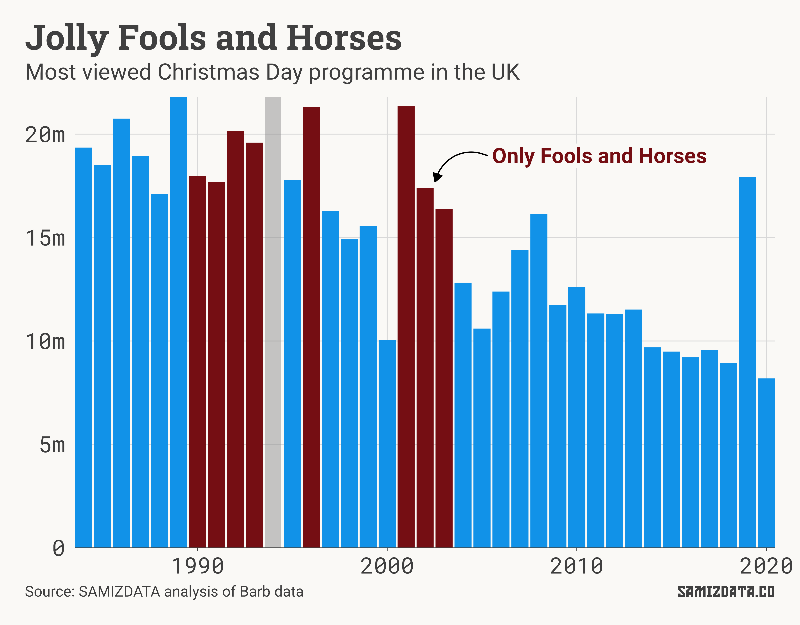
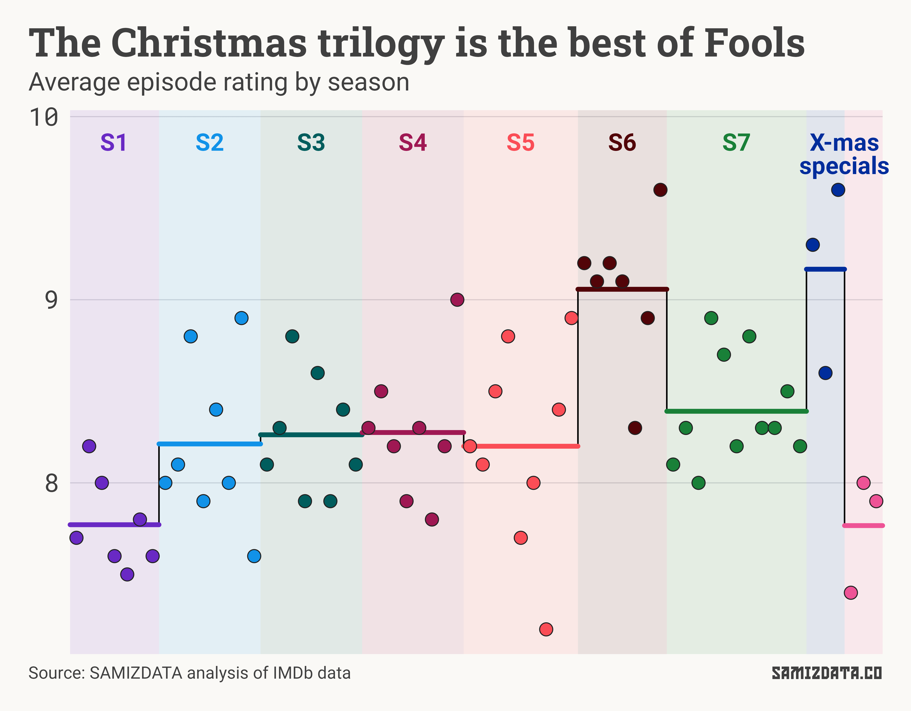
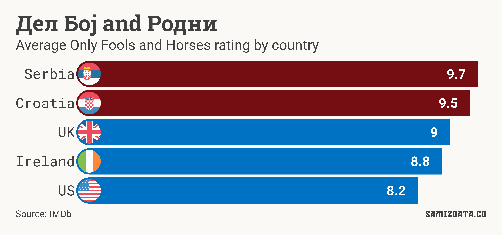
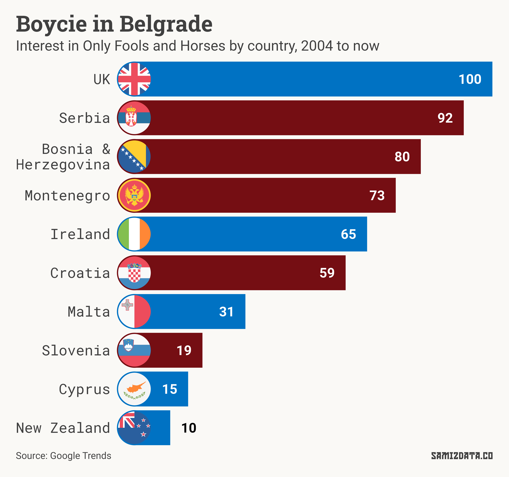
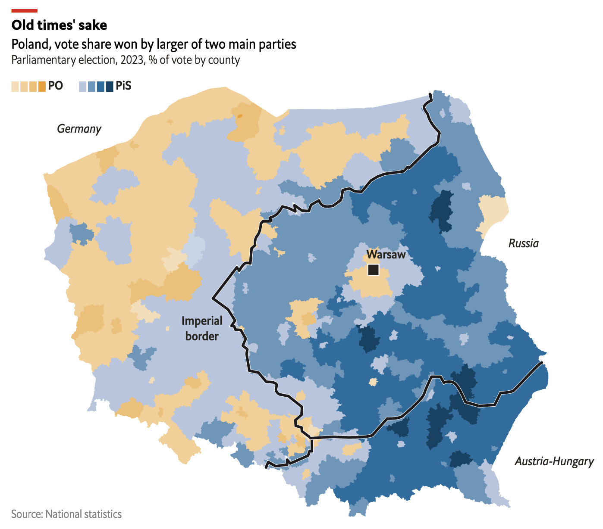

If you were in Britain on Christmas Day in 1992, chances are you sat in front of the TV to watch an episode of one of the most-beloved series in the country, *Only Fools and Horses*.

In that particular Christmas episode, protagonists Del Boy and Rodney come up with a plan to bottle and sell tap water under the “Peckham Spring” brand, named after a London district not far from where I live.

The episode came to public attention again in 2004, when journalists discovered that Coca-Cola’s newly-launched Dasani brand was just tap water bottled about 15km from Peckham. Tom Scott does a good job explaining that story in this video.

As Tom mentions, the episode was viewed by 20 million people, more than a third of the British population. It was by far the most viewed programme on that day, and one of the most viewed that year (as Christmas Day programmes tend to be).

This was not the first time — or the last — *Only Fools and Horses* took the top spot on Christmas.

In fact, it happened eight times between 1990 and 2003, according to figures from Barb, Britain’s television ratings company.

*Fools* was not only popular, it was well-liked. And I mean really well-liked.

On IMDb, it is the [35th best-rated TV series of all time](https://www.imdb.com/chart/toptv/) with an overall rating of 9/10, above classics such as *Seinfeld*, *Succession,* and *It's Always Sunny in Philadelphia*.

It didn’t start that way. The first season started off slow, and the characters were not fully-fleshed out. But the quality picks up in season 2 and peaks in season 6.

Nevertheless, the 1996 Christmas trilogy takes the top spot as the best “season”, with the third episode, *Time on Our Hands*, also being the best-rated episodes of the entire sitcom.

Overall, it’s an excellent series and I wholeheartedly recommend it.

## The Balkan connection

So, what about the title of this newsletter? What’s the Balkans got to do with it?

If you go back to the [IMDb ratings page](https://www.imdb.com/title/tt0081912/ratings/), you’ll see a filter that allows you to see the average rating *Only Fools and Horses* received by country.

Besides the UK, Ireland and the US, IMDb offers two more countries: Serbia and Croatia. And they love it even more that the Brits.

But let’s not limit ourselves to IMDb ratings.

A quick look at Google Trends shows us a similar picture. In the chart below, 100 means *Fools* has the most popularity as a fraction of total searches in the UK.

So while the UK takes the top spot, Serbia, Bosnia, Montenegro and Croatia are not far behind.

In Serbia and other Serbo-Croatian-speaking countries, the show is better known as *Mućke*, while in Macedonian it is *Spletki*. What stays the same is the popularity of the show.

So popular, in fact, that John Challis, the actor who plays the character Boycie, received an honorary Serbian citizenship.

In 2020, Challis even made a documentary called Boycie in Belgrade. You can watch the trailer’s below.

If you’re in Belgrade, might as well pop into [Kafe Mucke](https://maps.app.goo.gl/qfG9UCRUS3ZTAvEn9), the only *Fools*-themed restaurant in the world, allegedly. Why they didn’t call it “The Nag’s Head” is beyond me.

So why did a British show win so many hearts in the Balkans? Here’s a quote from [the](https://www.bbc.co.uk/news/world-europe-58630500) *[BBC](https://www.bbc.co.uk/news/world-europe-58630500)*.

> "Our mentality is similar," said 41-year-old Jelena Kraljevic, "the ways we manage to make ends meet and our wish to become millionaires."

And a similar opinion from *[The Guardian](https://www.theguardian.com/tv-and-radio/2010/jan/25/only-fools-and-horses-serbia)*.

> "The life of Del Boy and ­Rodney is very similar to life here. They always have some crazy ideas to make money. They always get themselves in some ridiculous situations," says Svetlana Zecevic, an ­officer in the Serbian Ministry of Finance, and a huge fan of the show.

And again from *The Sun* (which I’m not going to link to because it’s *The Sun*).

> Djordje says: “Boycie is a great example to us in Serbia. When we grew up watching Only Fools And Horses he was always doing some business, and that’s what we’ve been doing in Serbia for the past 30 years. All of us are thinking, ‘This time next year we’ll be millionaires’ — that’s the important thing for us.

Time for a rewatch. Just avoid the [American remake pilot](https://www.youtube.com/watch?v=Ob02R52HK3U).

---

### Postscriptum

The Pope went to Hungary. If you’re into that sort of thing, ATLO have [a visual story of that and other visits](https://atlo.team/wp-content/uploads/2023/07/francis.html). Why there are AI images in that article, I couldn’t tell you.

There were also elections in Poland earlier this month. As often happens, the results of the vote revealed some of Poland’s “phantom borders”. Check out [this article from](https://www.economist.com/graphic-detail/2023/10/19/imperial-borders-still-shape-politics-in-poland) *[The Economist](https://www.economist.com/graphic-detail/2023/10/19/imperial-borders-still-shape-politics-in-poland)* for more details.

---

Do you have any data analysis or visualisation needs? I might be able to help. Get in touch by replying to this email.

Also, don’t be a plonker; share this with a friend!