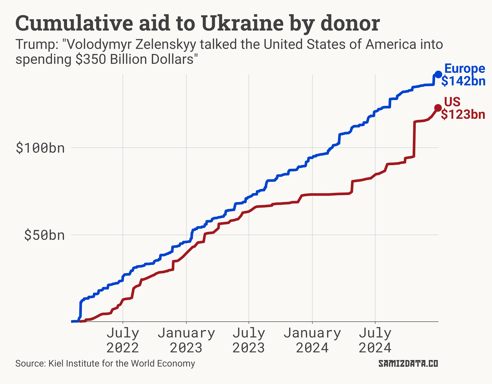
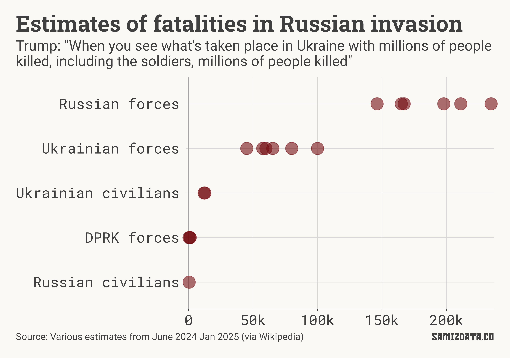
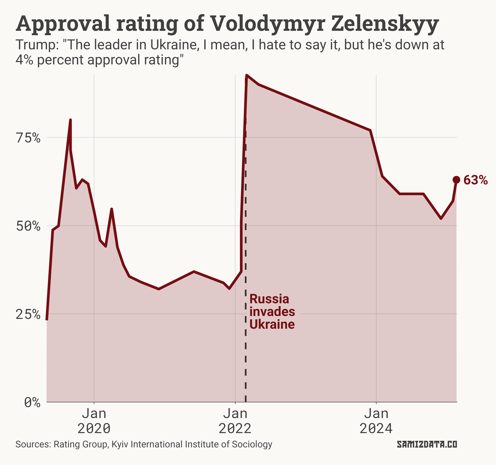

US president Donald ~~Krasnov~~ Trump hosted Ukrainian president Volodymyr Zelenskyy at the White House on Friday, if you can call it that.

Instead of the usual diplomatic pleasantries, Trump and his vice-president JD Vance attacked Zelenskyy for not saying "thank you" enthusiastically enough, accused him of "gambling with World War III", and then [promptly kicked him out of the White House](https://www.bbc.com/news/articles/c2erwgwy8vgo).

Among many of Trump's claims in his meeting with the Ukrainian leader, he said that the US has spent $350bn on the war in Ukraine. This is not the first time the US president has mentioned this figure.

Earlier this week, he justified forcing Ukraine to cede $500bn worth of its minerals by saying that the latter gets "$350bn and lots of equipment, military equipment and the right to fight on." He repeated the figure on Truth Social: "Volodymyr Zelenskyy talked the United States of America into spending $350 Billion Dollars, to go into a War that couldn’t be won, that never had to start, but a War that he, without the U.S. and “TRUMP,” will never be able to settle". The random capitalisation is his own.

Europe, according to the orange man, has only spent $100bn.

---

## How much did the US give Ukraine?

According to the [US government's Ukraine oversight working group](https://www.ukraineoversight.gov/Funding/), the US has allocated about $183bn to Ukraine since Russia's full-scale invasion. Of those, $65.9bn have actually gone to Ukraine, with another $58bn spent in the US.

Another set of figures comes from the [Kiel Institute for the World Economy](https://www.ifw-kiel.de/topics/war-against-ukraine/ukraine-support-tracker), a German think tank. They put the total US spending at $123bn, nearly three times less than Trump's claim. Europe, on the other hand, has spent $142bn, more than the US.

Like so many of the other Trump claims, the $350bn figure has no basis in reality. He now [wants to cut all aid to Ukraine](https://www.washingtonpost.com/politics/2025/02/28/trump-presidency-news/#link-U4SPRIDWBNBPZBXDLEHMNTMD7E).

---

## Millions of people killed

In one of his earlier rants last week, Trump also spoke of "millions of people killed, including the soldiers" in Ukraine.

That, of course, is also false.

While the exact numbers aren't publically known, the Ukrainian government, Western intelligence agencies, and independent journalists have come up with [estimates](https://en.wikipedia.org/wiki/Casualties_of_the_Russo-Ukrainian_War#Total_casualties) of casualties for troops and civilians on both sides of the conflict.

None of those estimates put the deaths in the millions. Even adding up the highest estimates of civilian and military fatalities, the total number would still be in the low hundreds of thousands.

Arguably, the deaths of Russian forces shouldn't even be counted as a reason to stop supporting Ukraine. In fact, they should be a reason to continue supporting Ukraine.

The deaths of Ukrainian soldiers and civilians are of course still tragic, but Trump's disregard for the truth is yet more proof that he doesn't really care about the people of Ukraine beyond using them as talking points.

---

## Approval rating

It feels odd to even bother with this one because it's so stupid, but let's do it anyway.

Trump says that Zelenskyy is "down at 4% approval rating."

This is, again, false. Hope you're catching on to the pattern here.

According to two polling agencies in Ukraine, Zelenskyy's approval rating has risen sharply since the full-scale Russian invasion of his country, and remains significantly higher than before 2022. In [recent polls](https://www.kiis.com.ua/?lang=eng&cat=reports&id=1497&page=1), his approval rating is on an upward trend, sitting at 63% in February.

Meanwhile, Trump's approval rating sits 15 points lower at 47.7%. Perhaps that explains some of his deranged behaviour?

---

Fact-checking Trump is, in many ways, a fool's errand. It would take a team working around the clock to keep up with his lies, and it wouldn't make a difference in the end.

This latest outburst against Ukraine, however, add to the steaming pile of evidence that the US is an unreliable ally at best, and an enemy at worst. In that pile are other brilliant decisions, such as the US siding with Russia, Iran and North Korea in the UN, and banning AP and Reuters journalists from the White House, while [allowing Russian state propaganda agency TASS](https://edition.cnn.com/2025/02/28/media/tass-russian-state-media-oval-office/index.html).

If Europe is to stand a chance in this new world order, it must be prepared to do so without the US, or even against it.

Слава Україні!