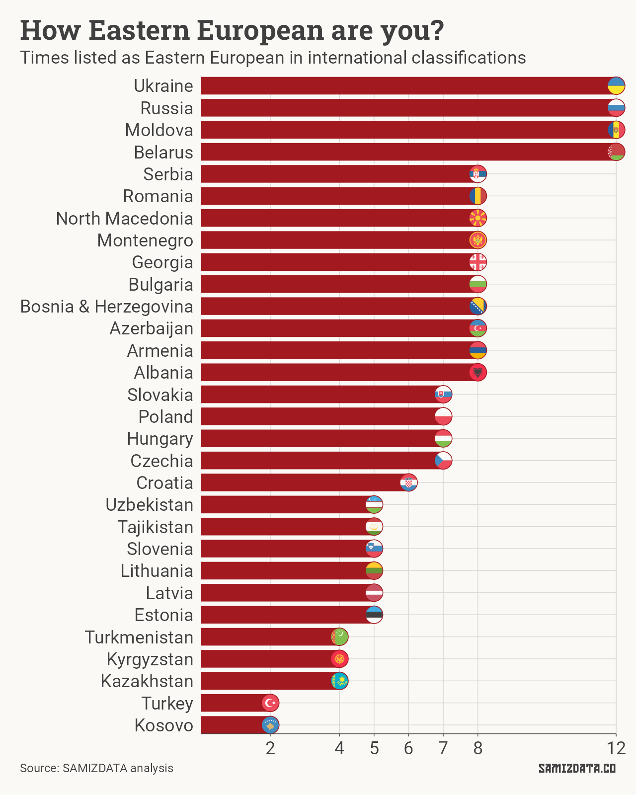

Welcome to the first edition of the SAMIZDATA newsletter.

If you’re reading this online, you can subscribe below or, if you’ve already subscribed, why not [share it with a friend](https://blog.samizdata.co/?utm_medium=email&action=share)?

Since this is a newsletter about Eastern Europe, it follows that a good starting point is defining what that is. Can data show us the way?

---

Back in 2013, I spent a summer in the United States, much of it lifeguarding, selling burgers and drinking what Americans call beer.

During the four months I was there, I had to introduce myself to a couple dozen people every week and, as is the custom, I’d lead with explaining where I’m from.

What started as an attempt to place Moldova on the mental map of my interlocutors turned into a defeatist reduction to “*I’m from Eastern Europe*”. Even though I never really associated with that identity, I ended up carrying it with me to the other two places I lived in the West, Denmark and the UK.

But what is Eastern Europe? For most people, it boils down to a Cold War stereotype of “Soviet” or “communist” countries. More than 30 years after the fall of the Soviet Union, many countries in the east are still introduced as “post-Soviet” or “ex-communist” in English-language newspapers. Is there more to it?

### Geography or cultural space?

When I went to the Czech Republic, some of the locals made a point of explaining that their country would be more accurately described as being in Central Europe, rather than Eastern Europe.

In many ways, that makes sense. Prague is further west than Vienna. Similarly, Bosnia’s east border is west of Finland. Hell, Portugal may be [an honorary member of Eastern Europe](https://www.reddit.com/r/PORTUGALCYKABLYAT/top/).

On the other hand, people in Georgia, Armenia or Kazakhstan will claim to be in Eastern Europe, even though they’re at or even beyond the limits of what most think of as Europe.

In the *Balkan Spirit* documentary, Slavoj Žižek jokes about how Austrians will claim the Balkans start in Slovenia, Slovenians will tell you that they start in Croatia, Croatians will point to Serbia, [and so on and so on](https://www.youtube.com/watch?v=SVXbQGZE-lI). Eastern Europe follows a similar approach.

<iframe src="https://www.youtube-nocookie.com/embed/3rpEQmtkstM?rel=0&autoplay=0&showinfo=0&enablejsapi=0" frameborder="0" loading="lazy" gesture="media" allow="autoplay; fullscreen" allowautoplay="true" allowfullscreen="true" width="728" height="409"></iframe>

Or, as author Francis Tapon [puts it](https://francistapon.com/Books/The-Hidden-Europe/Where-is-Eastern-Europe-and-what-countries-are-in-it):

> If you want to make Eastern Europeans twitch and squirm, just tell them that they are from Eastern Europe. The only people who don’t seem to care are the Moldovans. They’re just happy that anyone knows that Moldova exists.

At the risk of offending everyone but my fellow Moldovans, who is this newsletter for?

### What does the data say?

Regardless of the political boundary fuzziness, we need to settle on a list.

When in doubt, check the United Nations. The UN [recognises 23 countries](https://www.un.org/dgacm/en/content/regional-groups) in its “Eastern European States” Regional Group. Problem solved, right?

Not if you consider the UN’s geoscheme which, as [Wikipedia helpfully points out](https://en.wikipedia.org/wiki/United_Nations_geoscheme), is “not to be confused with [the] United Nations Regional Groups”. The geoscheme only includes 10 countries in the Eastern Europe subgroup.

Other UN agencies like UNICEF and UNESCO draw their own distinct borders around Eastern Europe, as do organisations including the IMF, OECD and the CIA.

I’ve looked at 12 different classifications to see the extent to which they overlap.

Four countries have made an appearance in each one of those lists: Moldova, Ukraine, Belarus and Russia. On the other end, Kosovo (not a UN member, so likely underrepresented) and Turkey made it onto just two of them.

Note that a few of the classifications I’ve used include “Eastern Europe and Central Asia” rather than purely Eastern Europe. But that’s good enough for me.

So what is Eastern Europe according to the international community?

There is no correct answer to that question, and there are many wrong ones. I don’t expect everyone to agree with this list. You might not either, or you might not care.

I’d rather take a broad approach and include as many countries as is reasonable. If you’re interested in any of the 30 countries listed above, do hang around, and bring some friends along.

If there are any topics you’d like me to look into, reply to this email and let me know. I’ll try to make it happen.

---

### Postscriptum

In unrelated news, I have been watching the excellent [TraumaZone documentary series from the BBC](https://www.youtube.com/watch?v=EDA3hIsf7LA&list=PLSjQL8MYniTTLA3wnZ25U-s6RgR4uJNvL&index=1). It’s seven hours of footage from all across the Soviet Union, and it does a decent job of showing how we ended up where we are.